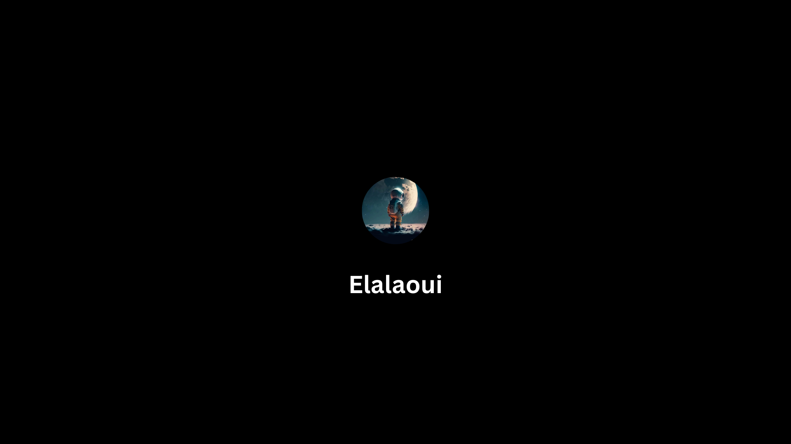

<h1 align="center">Hi 👋, I'm ELALAOUI</h1>
<h3 align="center">A passionate frontend developer</h3>

  

  

- 🌱 I’m currently learning **nextjs**

### Blogs posts
<!-- BLOG-POST-LIST:START -->
<!-- BLOG-POST-LIST:END -->

<h3 align="left">Connect with me:</h3>

<h3 align="left">Languages and Tools:</h3>

               
 

         

&nbsp;
  

